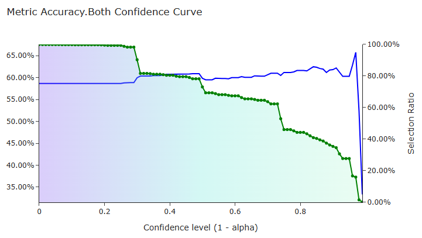

# Intro to factor metrics

### Validation Process

In factor validation, quantile regression is performed for each quantile to draw confidence interval at certain alpha.  
For a certain alpha (used 0.1), calculate metrics for `all`, `all_up`, `all_down`, `selected`, `selected_up` and `selected_down` of `y_val` 
and `y_true` to test prediction power of the model. 

### Metrics Functions  

There are 5 types of metrics functions used to evaluate factor utility for every `pred_var`.  
Note that `y_val` and `y_true` which are 1-d arrays are excepted for these functions. 

1. **Metrics of Error**:
    - MAE (Mean Absolute Error)  
    - MSE (Mean Squared Error)  
     
2. **Metrics of Accuracy**:  
    - Acc (Accuracy)  
    - Acc_Quantile (Accuracy by Quantile)  
     
3. **Metrics of Information**:  
    - IC (Information Coefficient)  
    - IC_Pearson (Pearson Correlation of Information Coefficient)  
     
4. **Metrics of Portfolio**:
    - Kelly  
     
5. **AUC_ROC** (Area Under the Curve - Receiver Operating Characteristic):  
    - Acc_AUC_ROC (Accuracy AUC ROC)  
    - IC_AUC_ROC (Information Coefficient AUC ROC)  

***

### Metrics File
After validation, Quark will generate metric files for each `pred_var` ending with `.metircs.html` in target dump dir.  
Following should be noted:

- `accuracy_baseline`  
  > Baseline assumes that one already knows the positive and negative distribution of `y_true` and
    makes decision based on the majority.  
  > e.g. `accuracy_baseline` for a day with 6:4 or 4:6 pos/neg `y_true` is 0.6.  
  > Accuracy metrics and its AUC-ROC is calculated using raw-baseline. And the accuracy baseline is around 60% and varys in days.  
- Accuracy Confidence Curve & IC Selection Curve  
  > For a good factor, its accuracy needs to increase linearly as the confidence level (1-alpha) increases, 
    and when the confidence level is so large that selection ratio is too small, the accuracy is allowed to decrease.  
  > 
  > A good factor AUC-ROC curve is like:
  > 
  > 
