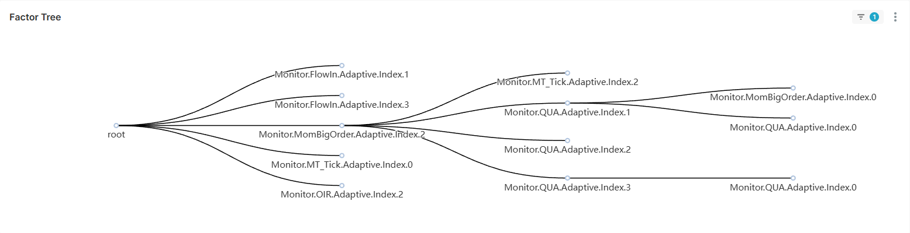

# How to test multi factors

`quark-fp/evaluation/selection.py` can be used to test multi factors.

### Manual selection of factors

Following script validates 2 factors together.  
- `Monitor.Aux.Adaptive.Index.0` of `quark-fp/factor_pool/auxiliary.py`  
- `Monitor.Intensity.Adaptive.Index.0` of `quark-fp/factor_pool/sharpe.py`
```python
def evaluate():
    start_date = datetime.date(2024, 1, 1)
    end_date = datetime.date(2024, 2, 1)
    cwd = pathlib.Path(__file__).parent
    tree = FactorTree()

    aux_node = FactorTree.get_node(
        name='Monitor.Aux.Adaptive.Index.0',
        file=str(pathlib.Path(cwd).parent.joinpath('factor_pool', 'auxiliary.py'))
    )
    tree.append(aux_node)

    factor_node = FactorTree.get_node(
        name='Monitor.Intensity.Adaptive.Index.0',
        file=str(pathlib.Path(cwd).parent.joinpath('factor_pool', 'sharpe.py'))
    )
    tree.append(factor_node)

    tree.evaluate(
        override_config={'Datalore.Calibration.l1': 0.001,
                         'Datalore.Calibration.l2': 0.001},
        resume=False,
        start_date=start_date,
        end_date=end_date,
        dtype=['TradeData'],
        validation_id=f'Simulation.{tree.digest()}',
        pred_var=list(str(_) for _ in FutureTopic),
        index_name='000016.SH',
        pred_target='IH_MAIN',
        strategy_mode=StrategyMode.sampling,
        dev_pool=True,
        override_cache=False
    )
```
Note that some config can override `config.ini` using param `override_config`.

---

### Auto selection of factors

Class `FactorForest` preforms brute-force factor selection, which finally generate best 
FactorTrees base on `metric_weight` stored in `{target_path}/factor_tree.csv`.


```python
def run_forest():
    start_date = datetime.date(2024, 10, 8)
    end_date = datetime.date(2024, 10, 18)

    factor_dir = pathlib.Path(os.getcwd()).parent.joinpath('quark-fp', 'factor_pool')
    base_pool = None
    # base_pool = ['sharpe', 'mt_tick', 'oir', 'momentum_bigorder', 'qua', 'voi', 'flow_in']
    metrics_weight = {'Acc_Confidence_AUC': 1}
    ema_alpha = 0.5
    n_nodes = 4
    branch_per_node = lambda node: 6 - node

    market = 'cn'
    index_name = '000016.SH'
    resume = True
    override_config = None
    override_config_all = {"Datalore.Calibration.pct_change_900.optimizer": 'Adam',
                           "Datalore.Calibration.state_3.optimizer": 'Adam',
                           "Datalore.Calibration.up_actual_3.optimizer": 'Adam',
                           "Datalore.Calibration.down_actual_3.optimizer": 'Adam',
                           "Datalore.Calibration.target_actual_3.optimizer": 'Adam',
                           "Datalore.Calibration.up_smoothed_3.optimizer": 'Adam',
                           "Datalore.Calibration.down_smoothed_3.optimizer": 'Adam',
                           "Datalore.Calibration.target_smoothed_3.optimizer": 'Adam'}
    dtype = ['TradeData', 'TickData']
    dev_pool = True
    override_cache = False
    target_path = end_date.strftime('%Y-%m-%d')

    forest = FactorForest(n_nodes=n_nodes, branch_per_node=branch_per_node)
    forest.run(
        factor_dir=factor_dir,
        base_pool=base_pool,
        resume=resume,
        override_config=override_config,
        override_config_all=override_config_all,
        start_date=start_date,
        end_date=end_date,
        metrics_weight=metrics_weight,
        ema_alpha=ema_alpha, market=market,
        dtype=dtype,
        dev_pool=dev_pool,
        override_cache=override_cache,
        index_name=index_name,
        target_path=target_path
    )
```

- `factor_dir` & `base_pool` are the factor path and files that determine scope of auto selection.  
- `metrics_weight` is a weighted dict, based on which the overall metrics is calculated.  
- `ema_alpha` defines how the overall metrics decay over time.  
- `n_nodes-1` is the max depth of optimal FactorTree.
- `branch_per_node` defines how many FactorTree is retained in certain depth. In the demo, it will be 5 trees in depth1, 4 trees in depth2 and 3 trees in depth3. 
- Optimizer in `override_config_all` should be tuned to `Adam`, because Scipy and CVXPY optimizer may fail if dimension of ***X*** is too large.