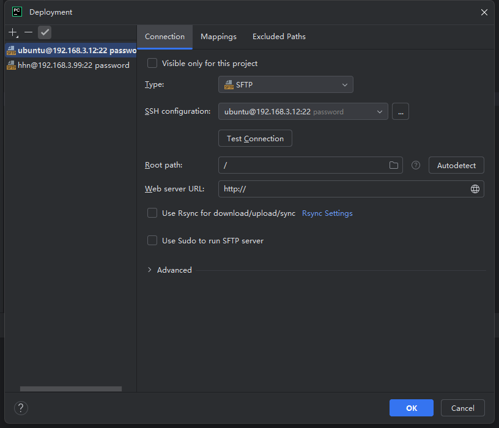
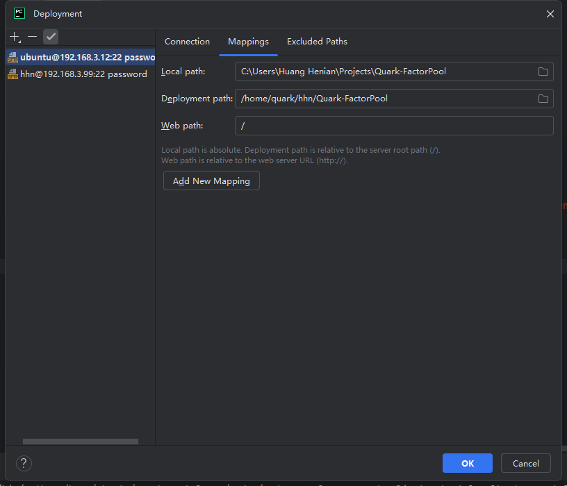
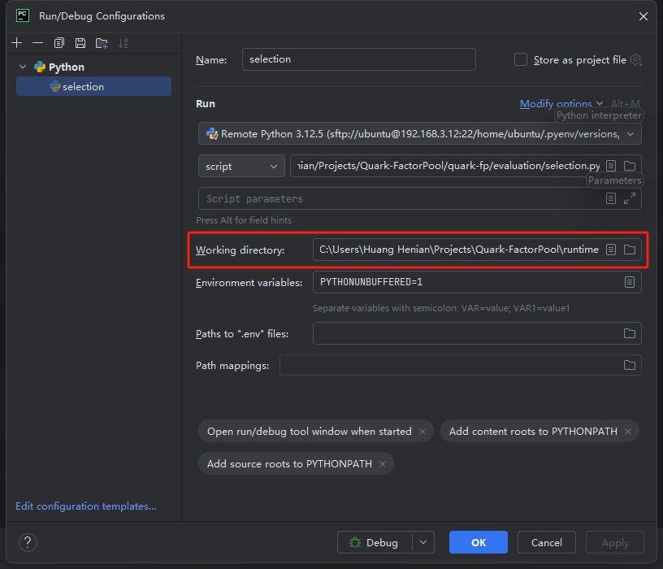

# Setup Environment

Pycharm is recommended for remote deployment.

## On venv_312
Quark is complied and installed in venv_312.

1. Clone `Quark-FactorPool` from https://github.com/CREO-Quark/Quark-FactorPool
   ```bash
   git clone https://github.com/CREO-Quark/Quark-FactorPool.git
   ```
2. SSH to 192.168.3.12
3. Select venv_312 as remote python interpreter
4. Setup deployment config in `Tools`->`Deployment`->`Configration`
    1. Setup SSH configuration
       
    2. Setup path mappings, which will automatically sync changes in local and remote path
       
5. Set work dictionary and config.ini for quark  
    In script `quark-fp\evaluation\selection.py`, debug with setting: 
